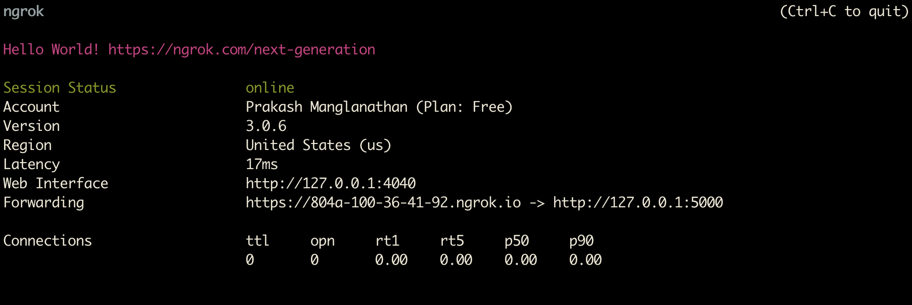
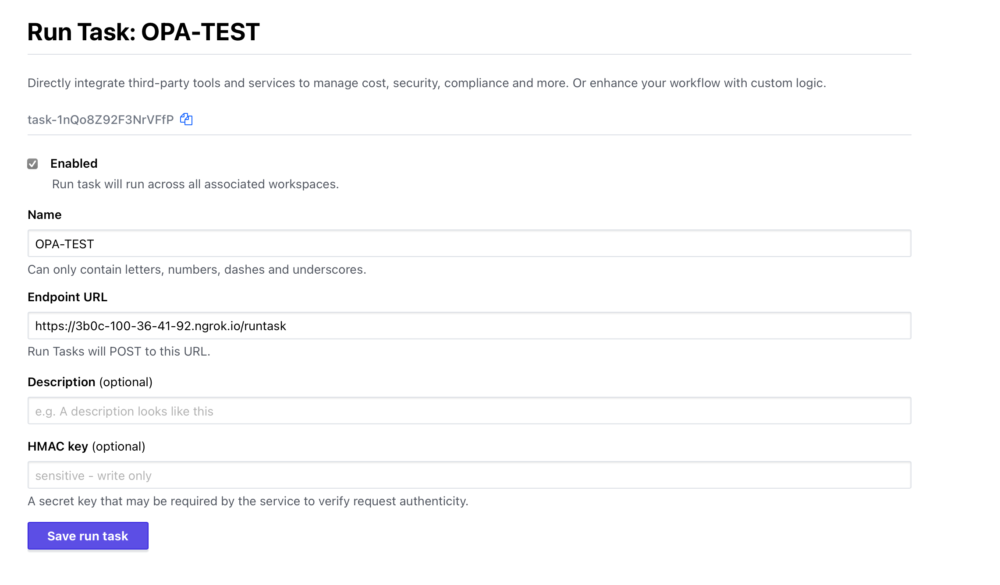
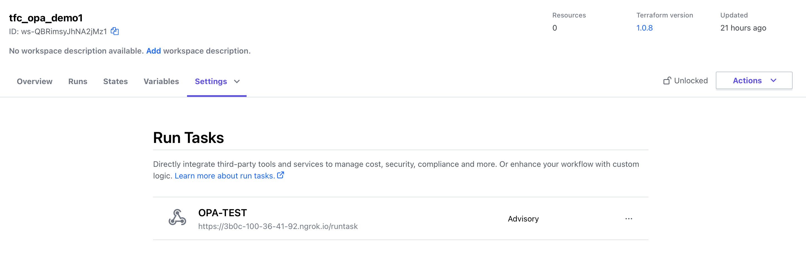

# TFC OPA RunTask Server

## Local Dev Server Setup
 Required prerequisites - Python 3, pip & OPA. 
 
 To expose the server to a public URL for integration with TFC Run Task use a tool such as [ngrok](https://ngrok.com).

```
# Download OPA Binary
> curl -L -o opa https://openpolicyagent.org/downloads/v0.43.0/opa_darwin_amd64

#ensure OPA is executable
> chmod 755 opa

#install prerequisites
> pip install -r requirements.txt

#start the Server
> export FLASK_APP=hello
> flask run --debug  ##debug auto reloads any python code changes
```

In a seperate terminal you can start ngrok using the following command

```
> ngrok http http://127.0.0.1:5000
```



Register a custom run task in Teraform Cloud. For the endpoint url use the urd exposed by ngrok.



Ensure that the runtask is assigned to a workspace

